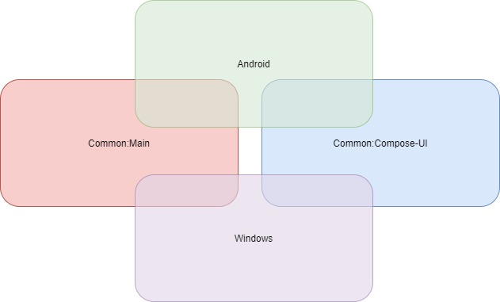

# wire
The Wire is a Kotlin Multiplatform sample project, currently supporting Android and Windows.

## Tools And Technolagies
* Architecture: [MVVM](http://hannesdorfmann.com/android/model-view-intent)
* MultiThreading: [Coroutines](https://kotlinlang.org/docs/reference/coroutines/coroutines-guide.html)
* Android DI: [Koin](https://insert-koin.io/)
* General Networking: [ktor.http](https://ktor.io/clients/http-client/engines.html)
* Kotlin Multiplatform [KMP](https://kotlinlang.org/docs/reference/multiplatform.html)
* Jetpack Compose [compose](https://developer.android.com/jetpack/compose)

## About
  You can try out new technologies on this playground.

### Modules
   `android` and `desktop(windows)` modules are platform specific.
   
   `common:main`: shared business logic.
   
   `common:compose-ui`: shared compose ui components.
   

## Installing & Running

  **Download the Wire source code** 
 
  Clone the source code by `git clone https://github.com/rezaiyan/wire.git` and wait for the Gradle build to succeed
  
  To run the windows application run the following command `gradlew desktop:run`
  
  **Requirements**
  
* Android Studio Arctic Fox or higher
* Android gradle plugin version 4.2.1
* Gradle version 6.9

## Goals
- [ ] Establish the clean architecture and MVI pattern.
- [ ] Applying SOLID principles to achieve a testable code
- [ ] Having a better UI design.
- [ ] Make use of another free API to fill the screen.

## Contributing
Contributions and feedback are always welcome, so please feel free to get started!
